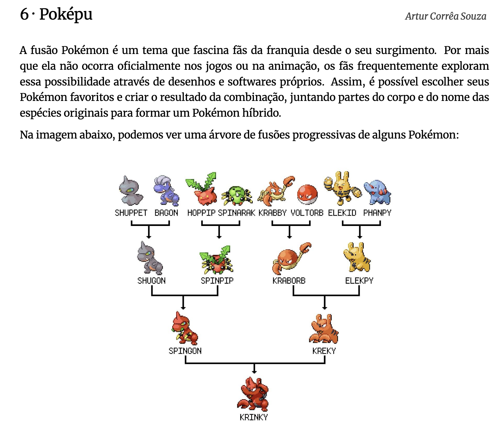

::: nota-secundaria
Roteiro de aula elaborado no RStudio com o auxílio da inteligência artificial ChatGPT e supervisionado pelo professor antes de sua publicação.
:::

## Contextualização

Desde os tempos mais remotos, os seres humanos buscam **compreender os fenômenos** que os cercam, formulando explicações e crenças a partir da experiência cotidiana. No entanto, muitas dessas interpretações são limitadas por visões parciais da realidade, influenciadas por emoções, tradições ou coincidências. Neste encontro, refletiremos sobre **o que distingue a ciência de outros modos de conhecer o mundo** e compreenderemos como o **pensamento científico**, ao se apoiar em métodos rigorosos, ceticismo organizado e revisão constante, oferece uma das formas mais confiáveis de produzir conhecimento e orientar decisões racionais em um mundo marcado pela incerteza.

Ao final deste encontro e com base na leitura indicada, espera-se que você seja capaz de:

-   *Distinguir explicações baseadas em evidências científicas de afirmações baseadas em senso comum, analisando exemplos de linguagem vaga, promessas absolutas e ausência de dados empíricos.*

::: leitura
Leitura indicada:

**Afinal, o que é Ciência?** (p. 9-12), capítulo do livro *Afinal o que é ciência?... e o que não é*, de André Demambre Bacchi. Disponível na Minha Biblioteca.
:::

## Leitura em foco

::: citacao
A palavra “Ciência” tem origem no latim *scientia*, que significa conhecimento. (Bachi, 2024 - ebook - destaques do autor).
:::

::: citacao
Ciência se refere a um grande empreendimento coletivo da Humanidade, que **organiza nossos conhecimentos e predições** sobre o Universo. (Bachi, 2024 - ebook - destaques meus).
:::

::: citacao
Esses conhecimentos são obtidos, confrontados e atualizados por meio de um método próprio (…) transparente e apoiado em um **ceticismo organizado**, que nos ajuda a reduzir as incertezas que temos sobre o mundo que nos cerca. (Bachi, 2024 - ebook - destaques meus).
:::

::: enfase
O **pensamento científico** se aplica sempre que buscamos tomar decisões baseadas em evidências (e não nos costumes ou na intuição). Ele se manifesta quando:

-   Questionamos informações antes de aceitá-las como verdadeiras
    -   *Como avaliar se um vídeo na internet que promete curar dores nas articulações com uma receita caseira é confiável?*
-   Buscamos explicações fundamentadas e verificáveis sobre os fenômenos do mundo
    -   *Como investigar por que a conta de água da sua casa aumentou muito em comparação com os meses anteriores?*
-   Analisamos causas e efeitos com base em dados, não em suposições
    -   *Como verificar se o aumento no tempo de uso do celular está afetando a qualidade do sono?*
-   Testamos hipóteses e aprendemos com os erros
    -   *Se uma planta da casa está murchando, como testar se o problema é falta de água, excesso de sol ou qualidade do solo?*
-   Rejeitamos conclusões apressadas e consideramos a complexidade dos contextos
    -   *Como avaliar a afirmação de que “os jovens de hoje não gostam de ler” sem se basear apenas em experiências pessoais?*
:::

<br/>

## Aprendizagem prática

::: subtitulo-nao-numerado
Reflexão
:::

::: subsubtitulo-nao-numerado
Como aplicar o pensamento científico?
:::

Estabeleça a correspondência entre cada forma de pensar cientificamente e sua aplicação prática no processo de escolha de uma dieta.

::: destaque
| 🔬 Formas de pensar | 🧩 Aplicações práticas |
|------------------------------------|------------------------------------|
| **A) Formular hipóteses testáveis** | **1)** Analisar estudos clínicos publicados em revistas científicas sobre os efeitos de diferentes dietas. |
| **B) Buscar evidências confiáveis** | **2)** Observar se, após um mês seguindo a dieta, houve melhora nos exames e no bem-estar geral. |
| **C) Considerar variáveis contextuais** | **3)** Verificar se a dieta escolhida se adequa à rotina pessoal, às condições de saúde e ao orçamento familiar. |
| **D) Evitar generalizações apressadas** | **4)** Refletir se a dieta que funcionou para um amigo realmente é apropriada para você. |
| **E) Consultar profissionais especializados** | **5)** Levantar a dúvida: “Será que a dieta X reduz mais gordura abdominal do que a dieta Y?” |
| **F) Acompanhar resultados e reavaliar** | **6)** Marcar uma consulta com um nutricionista antes de iniciar qualquer dieta. |
:::

<!-- Aqui começa o campo de respostas-->

<details class="resposta-escondida">

<summary>...</summary>

A - 5

B - 1

C - 3

D - 4

E - 6

F - 2

</details>

<!-- Aqui encerra o campo de respostas-->

<br/>

## Aprendizagem prática

::: subtitulo-nao-numerado
Produção de texto
:::

::: destaque
**Como exercitar o ceticismo organizado?**
:::

Você já se deparou com vídeos ou manchetes que prometem curas milagrosas ou soluções rápidas para problemas complexos? Nesta atividade, vamos exercitar nossa capacidade de pensar cientificamente.

Responda por escrito à seguinte pergunta: *A receita apresentada no vídeo pode ser considerada uma recomendação científica? Quais critérios científicos permitem justificar sua resposta?* Justifique sua resposta com base nos critérios que diferenciam o senso comum do pensamento científico. Rascunhe a resposta em papel, à mão, e somente depois transcreva-a no [Painel de respostas](complemento_painel.qmd). No Painel de respostas, selecione a tarefa: **Ceticismo organizado**.

```{=html}
<div style="display: flex; justify-content: center; margin-top: 1rem; margin-bottom: 1rem;">
  <iframe 
    width="384" 
    height="682" 
    src="https://www.youtube.com/embed/qLkfKPV9ZU0?si=C4wC8Hq4KN52mn44" 
    title="Foi Assim Que RECUPEREI O COLÁGENO depois dos 35 anos e Parei com a DOR NO JOELHO" 
    frameborder="0" 
    allow="accelerometer; autoplay; clipboard-write; encrypted-media; gyroscope; picture-in-picture; web-share" 
    referrerpolicy="strict-origin-when-cross-origin" 
    allowfullscreen>
  </iframe>
</div>
```

<!-- Aqui começa o campo de respostas-->

<details class="resposta-escondida">

<summary>...</summary>

Quais são os elementos não científicos no vídeo?

-   Linguagem vaga: expressões como "lá pelos 50 anos", “tarde demais”, “pele bonita” e “melhorar a saúde” não são mensuráveis.
-   Promessas absolutas: afirma que “seus problemas vão acabar” sem qualquer comprovação.
-   Apelo à autoridade implícita: o canal se apresenta como confiável, mas não cita fontes nem especialistas.
-   Ausência de dados: não há estatísticas, estudos, nem explicações sobre doses ou eficácia real.
-   Relações causais forçadas: ingredientes com vitamina C e magnésio são relacionados diretamente à produção de colágeno sem evidência científica.

Quais são as fontes confiáveis citadas?

-   O vídeo não menciona estudos, instituições científicas ou profissionais da saúde.

O que seria necessário para testar cientificamente?

-   Hipótese clara: “O consumo diário da receita X reduz dor articular em adultos?”
-   Experimento controlado: grupos com e sem a receita, de forma aleatória e cega.
-   Variáveis controladas: alimentação, idade, saúde prévia, medicamentos.
-   Evidências: exames clínicos, questionários validados, análise estatística dos resultados.

</details>

<!-- Aqui encerra o campo de respostas-->

## Leitura em foco

::: citacao
\[Os\] conhecimentos \[científicos\] são analisados e interpretados de modo contextual à luz do **ecossistema científico existente**. (Bachi, 2024 - ebook - destaques meus).
:::

::: citacao
Para boa parte de nós, as evidências científicas **não** são um fator determinante no momento de tomar alguma decisão pessoal. (Bachi, 2024 - ebook - destaques meus).
:::

::: citacao
**Coincidências** podem acontecer durante o percurso. (...) São coincidências que reforçam uma determinada crença e que, consequentemente, nos afastam da Ciência. (Bachi, 2024 - ebook - destaques meus).
:::

::: citacao
É justamente esse tipo de “miopia” que precisamos evitar. (Bachi, 2024 - ebook - destaques do autor).
:::

::: citacao
É aí que a Ciência entra como um par de óculos que nos ajudam a ver o mundo com mais clareza. Ao nos fornecer uma **maneira sistemática e rigorosa de coletar, analisar e interpretar dados e informações**, a Ciência nos permite ver além das limitações da nossa percepção pessoal e obter uma compreensão mais precisa da realidade. (Bachi, 2024 - ebook - destaques meus).
:::

::: citacao
O mundo é probabilístico.
:::

::: citacao
Se até agora o senso comum guiou suas escolhas práticas por meio de tentativa e erro, chegou o momento de mergulharmos na ferramenta mais confiável e essencial para a tomada de decisões racionais: **o pensamento científico**. (Bachi, 2024 - ebook - destaques meus).
:::

## Aprendizagem prática

::: subtitulo-nao-numerado
Desafio
:::

::: subsubtitulo-nao-numerado
Vamos estimular nosso pensamento científico?
:::

Desenvolver o pensamento científico e o senso crítico não depende apenas do acesso a informações, mas sobretudo da capacidade de organizar o pensamento, identificar padrões, formular hipóteses, interpretar dados e avaliar explicações possíveis para um problema. Essas são habilidades fundamentais para a produção de conhecimento científico.

Um dos caminhos para exercitar essas competências é o **pensamento analítico**. Ele consiste na capacidade de observar informações, reconhecer regularidades, testar possibilidades e tirar conclusões a partir de evidências ou regras identificadas.

Embora o exercício a seguir não seja um problema científico no sentido estrito, ele mobiliza **habilidades cognitivas** que também estão na base da investigação científica, como atenção, memória, análise, síntese e inferência. Essas habilidades são essenciais tanto para resolver problemas do cotidiano quanto para compreender e produzir argumentos bem fundamentados.

Para exercitá-las, segue um desafio que exigirá de você concentração, raciocínio lógico e uma boa dose de curiosidade. Em duplas, resolvam a questão abaixo:



<br/><br/>

Nesta árvore, os nomes dos personagens híbridos são formados a partir de um padrão geral, com exceção de apenas dois. **Se** os nomes de todos os Pokémon fossem formados seguindo o padrão geral, qual **não** poderia ser um nome possível para o último Pokémon da árvore (o mais de baixo)?

a)  krabgon
b)  elekgon
c)  spinpy
d)  spinky
e)  spinorb

<!-- Aqui começa o campo de respostas-->

<details class="resposta-escondida">

<summary>...</summary>

**Resposta correta: (d)**

Descobrindo o padrão

Os nomes dos híbridos são formados **combinando o início de um nome com o final de outro**.

Exemplos:

shuppet + bagon shu- -gon ↓ ↓ shugon

spinarak + hoppip spin- -pip ↓ ↓ spinpip

krabby + voltorb krab- -orb ↓ ↓ kraborb

elekid + phanpy elek- -py ↓ ↓ elekpy

A regra é:

> **início de um nome + final de outro nome**

Testando a regra na linha seguinte

spinpip + shugon → spingon ✔ kraborb + elekpy → kreky ✖

-   **spingon** segue o padrão.
-   **kreky** não segue: ele não usa corretamente **krab-** nem **-py**.

Assim, **kreky é o primeiro nome fora do padrão**.

3.  O próximo híbrido

kreky + spingon → krinky

Como **kreky já está errado**, **krinky também não segue o padrão**.

Portanto:

-   1º fora do padrão → **kreky**
-   2º fora do padrão → **krinky**

4.  Como deveriam ser os nomes corretos

Se **kraborb** e **elekpy** fossem combinados corretamente:

kraborb + elekpy ↓ ↓ krabpy ou elekorb

5.  Última fusão possível

Agora combinamos **spingon** com esses nomes:

spingon + krabpy → spinpy ou krabgon spingon + elekorb → spinorb ou elekgon

Esses quatro nomes aparecem nas alternativas.

6.  Identificando o impossível

A alternativa **spinky** depende do nome **kreky**, que já vimos estar fora do padrão.

Portanto, **spinky não pode existir**.

</details>

<!-- Aqui encerra o campo de respostas-->

::: proxima-aula
[Para a próxima aula:]{.proxima-aula-title}

-   **Leia** o texto **Pensamento crítico** (p. 3-9), capítulo do livro *Pensamento crítico: o poder da lógica e da argumentação*, de Walter Carnielli e Richard Epstein. Disponível na Biblioteca Virtual.
:::

::: destaque
*Sugestão de leitura*

-   **Observe, test, reflect: A better life with the scientific method**, artigo de Santiago Gisler publicado pela *Ivory Embassy*. Disponível em: https://ivoryembassy.com/the-scientific-method/.
:::
