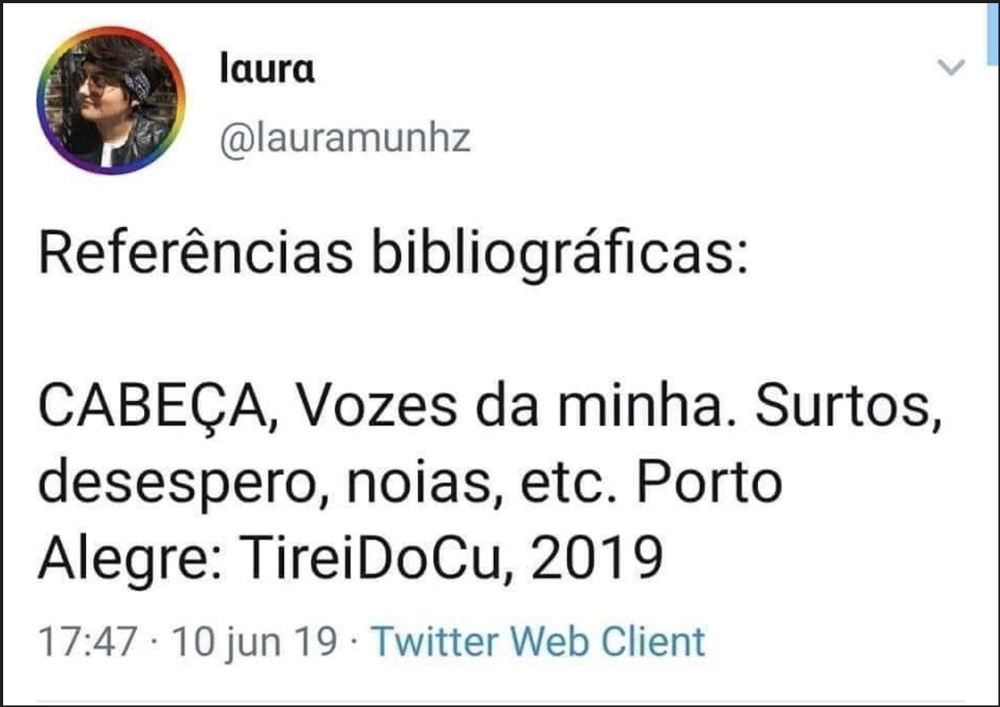
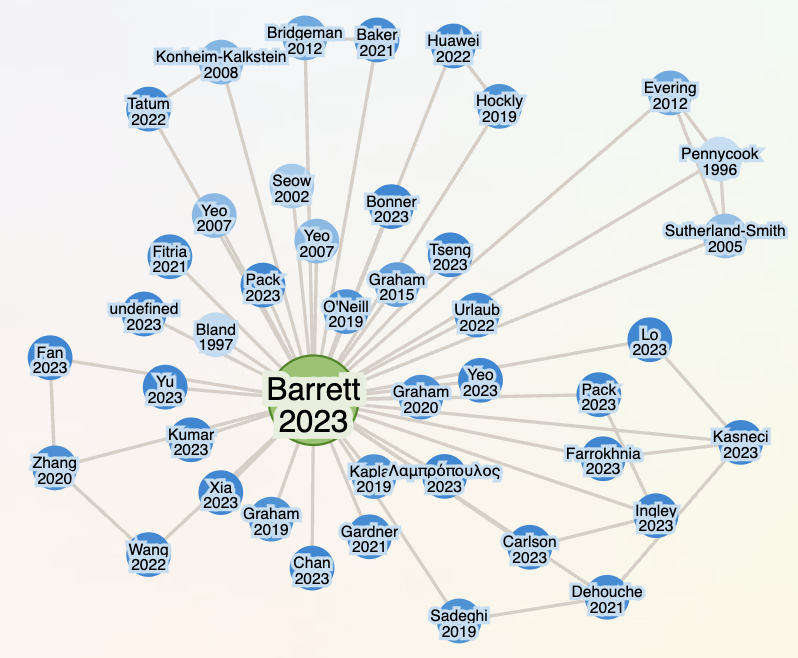
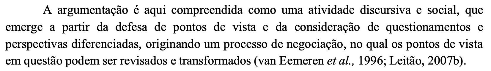
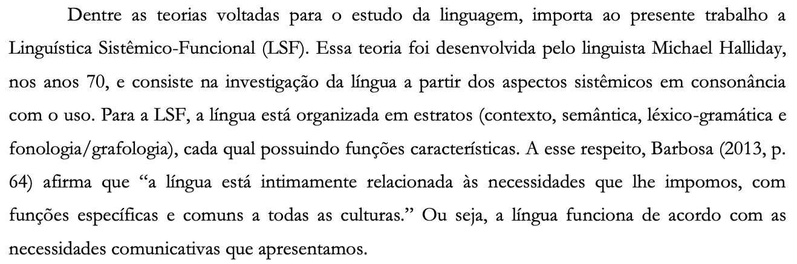
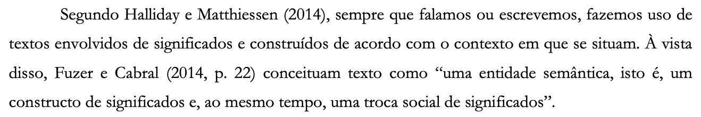
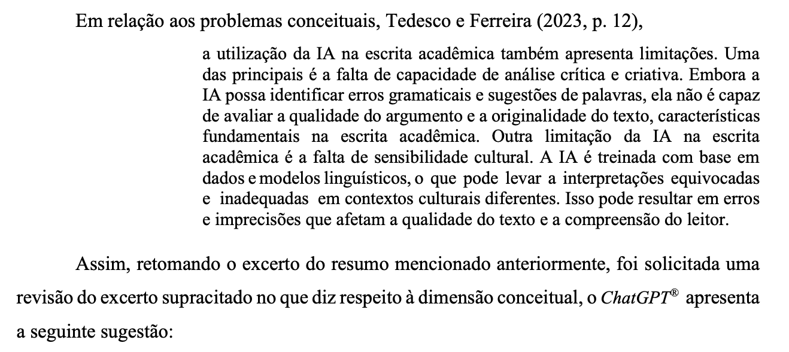
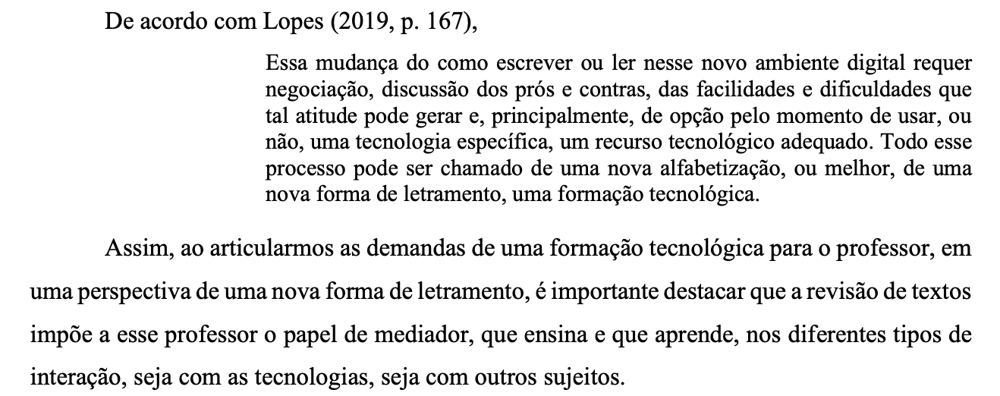
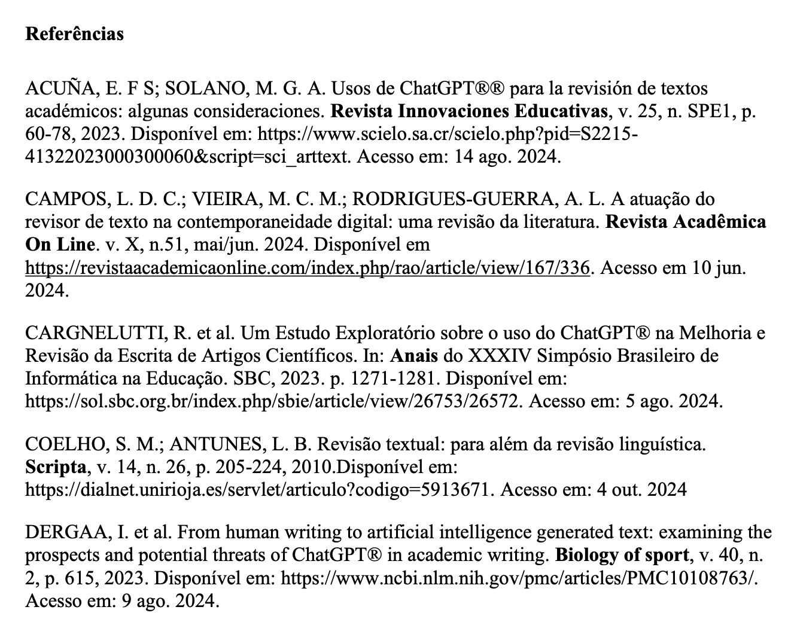

## Contextualização[^aula_7-1]

[^aula_7-1]: Roteiro de aula elaborado no RStudio com o auxílio de modelos de linguagem (IA) e supervisionado pelo professor antes de sua publicação.

```{=html}
<div style="max-width:320px; margin: 0 auto;">
<blockquote class="instagram-media" data-instgrm-captioned data-instgrm-permalink="https://www.instagram.com/reel/DDJx5r0JYq3/?utm_source=ig_embed&amp;utm_campaign=loading" data-instgrm-version="14" style=" background:#FFF; border:0; border-radius:3px; box-shadow:0 0 1px 0 rgba(0,0,0,0.5),0 1px 10px 0 rgba(0,0,0,0.15); margin: 1px; max-width:320px; min-width:320px; padding:0; width:99.375%; width:-webkit-calc(100% - 2px); width:calc(100% - 2px);"><div style="padding:16px;"> <a href="https://www.instagram.com/reel/DDJx5r0JYq3/?utm_source=ig_embed&amp;utm_campaign=loading" style=" background:#FFFFFF; line-height:0; padding:0 0; text-align:center; text-decoration:none; width:100%;" target="_blank"> <div style=" display: flex; flex-direction: row; align-items: center;"> <div style="background-color: #F4F4F4; border-radius: 50%; flex-grow: 0; height: 40px; margin-right: 14px; width: 40px;"></div> <div style="display: flex; flex-direction: column; flex-grow: 1; justify-content: center;"> <div style=" background-color: #F4F4F4; border-radius: 4px; flex-grow: 0; height: 14px; margin-bottom: 6px; width: 100px;"></div> <div style=" background-color: #F4F4F4; border-radius: 4px; flex-grow: 0; height: 14px; width: 60px;"></div></div></div><div style="padding: 19% 0;"></div> <div style="display:block; height:50px; margin:0 auto 12px; width:50px;"><svg width="50px" height="50px" viewBox="0 0 60 60" version="1.1" xmlns="https://www.w3.org/2000/svg" xmlns:xlink="https://www.w3.org/1999/xlink"><g stroke="none" stroke-width="1" fill="none" fill-rule="evenodd"><g transform="translate(-511.000000, -20.000000)" fill="#000000"><g><path d="M556.869,30.41 C554.814,30.41 553.148,32.076 553.148,34.131 C553.148,36.186 554.814,37.852 556.869,37.852 C558.924,37.852 560.59,36.186 560.59,34.131 C560.59,32.076 558.924,30.41 556.869,30.41 M541,60.657 C535.114,60.657 530.342,55.887 530.342,50 C530.342,44.114 535.114,39.342 541,39.342 C546.887,39.342 551.658,44.114 551.658,50 C551.658,55.887 546.887,60.657 541,60.657 M541,33.886 C532.1,33.886 524.886,41.1 524.886,50 C524.886,58.899 532.1,66.113 541,66.113 C549.9,66.113 557.115,58.899 557.115,50 C557.115,41.1 549.9,33.886 541,33.886 M565.378,62.101 C565.244,65.022 564.756,66.606 564.346,67.663 C563.803,69.06 563.154,70.057 562.106,71.106 C561.058,72.155 560.06,72.803 558.662,73.347 C557.607,73.757 556.021,74.244 553.102,74.378 C549.944,74.521 548.997,74.552 541,74.552 C533.003,74.552 532.056,74.521 528.898,74.378 C525.979,74.244 524.393,73.757 523.338,73.347 C521.94,72.803 520.942,72.155 519.894,71.106 C518.846,70.057 518.197,69.06 517.654,67.663 C517.244,66.606 516.755,65.022 516.623,62.101 C516.479,58.943 516.448,57.996 516.448,50 C516.448,42.003 516.479,41.056 516.623,37.899 C516.755,34.978 517.244,33.391 517.654,32.338 C518.197,30.938 518.846,29.942 519.894,28.894 C520.942,27.846 521.94,27.196 523.338,26.654 C524.393,26.244 525.979,25.756 528.898,25.623 C532.057,25.479 533.004,25.448 541,25.448 C548.997,25.448 549.943,25.479 553.102,25.623 C556.021,25.756 557.607,26.244 558.662,26.654 C560.06,27.196 561.058,27.846 562.106,28.894 C563.154,29.942 563.803,30.938 564.346,32.338 C564.756,33.391 565.244,34.978 565.378,37.899 C565.522,41.056 565.552,42.003 565.552,50 C565.552,57.996 565.522,58.943 565.378,62.101 M570.82,37.631 C570.674,34.438 570.167,32.258 569.425,30.349 C568.659,28.377 567.633,26.702 565.965,25.035 C564.297,23.368 562.623,22.342 560.652,21.575 C558.743,20.834 556.562,20.326 553.369,20.18 C550.169,20.033 549.148,20 541,20 C532.853,20 531.831,20.033 528.631,20.18 C525.438,20.326 523.257,20.834 521.349,21.575 C519.376,22.342 517.703,23.368 516.035,25.035 C514.368,26.702 513.342,28.377 512.574,30.349 C511.834,32.258 511.326,34.438 511.181,37.631 C511.035,40.831 511,41.851 511,50 C511,58.147 511.035,59.17 511.181,62.369 C511.326,65.562 511.834,67.743 512.574,69.651 C513.342,71.625 514.368,73.296 516.035,74.965 C517.703,76.634 519.376,77.658 521.349,78.425 C523.257,79.167 525.438,79.673 528.631,79.82 C531.831,79.965 532.853,80.001 541,80.001 C549.148,80.001 550.169,79.965 553.369,79.82 C556.562,79.673 558.743,79.167 560.652,78.425 C562.623,77.658 564.297,76.634 565.965,74.965 C567.633,73.296 568.659,71.625 569.425,69.651 C570.167,67.743 570.674,65.562 570.82,62.369 C570.966,59.17 571,58.147 571,50 C571,41.851 570.966,40.831 570.82,37.631"></path></g></g></g></svg></div><div style="padding-top: 8px;"> <div style=" color:#3897f0; font-family:Arial,sans-serif; font-size:14px; font-style:normal; font-weight:550; line-height:18px;">Ver essa foto no Instagram</div></div><div style="padding: 12.5% 0;"></div> <div style="display: flex; flex-direction: row; margin-bottom: 14px; align-items: center;"><div> <div style="background-color: #F4F4F4; border-radius: 50%; height: 12.5px; width: 12.5px; transform: translateX(0px) translateY(7px);"></div> <div style="background-color: #F4F4F4; height: 12.5px; transform: rotate(-45deg) translateX(3px) translateY(1px); width: 12.5px; flex-grow: 0; margin-right: 14px; margin-left: 2px;"></div> <div style="background-color: #F4F4F4; border-radius: 50%; height: 12.5px; width: 12.5px; transform: translateX(9px) translateY(-18px);"></div></div><div style="margin-left: 8px;"> <div style=" background-color: #F4F4F4; border-radius: 50%; flex-grow: 0; height: 20px; width: 20px;"></div> <div style=" width: 0; height: 0; border-top: 2px solid transparent; border-left: 6px solid #f4f4f4; border-bottom: 2px solid transparent; transform: translateX(16px) translateY(-4px) rotate(30deg)"></div></div><div style="margin-left: auto;"> <div style=" width: 0px; border-top: 8px solid #F4F4F4; border-right: 8px solid transparent; transform: translateY(16px);"></div> <div style=" background-color: #F4F4F4; flex-grow: 0; height: 12px; width: 16px; transform: translateY(-4px);"></div> <div style=" width: 0; height: 0; border-top: 8px solid #F4F4F4; border-left: 8px solid transparent; transform: translateY(-4px) translateX(8px);"></div></div></div> <div style="display: flex; flex-direction: column; flex-grow: 1; justify-content: center; margin-bottom: 24px;"> <div style=" background-color: #F4F4F4; border-radius: 4px; flex-grow: 0; height: 14px; margin-bottom: 6px; width: 224px;"></div> <div style=" background-color: #F4F4F4; border-radius: 4px; flex-grow: 0; height: 14px; width: 144px;"></div></div></a><p style=" color:#c9c8cd; font-family:Arial,sans-serif; font-size:14px; line-height:17px; margin-bottom:0; margin-top:8px; overflow:hidden; padding:8px 0 7px; text-align:center; text-overflow:ellipsis; white-space:nowrap;"><a href="https://www.instagram.com/reel/DDJx5r0JYq3/?utm_source=ig_embed&amp;utm_campaign=loading" style=" color:#c9c8cd; font-family:Arial,sans-serif; font-size:14px; font-style:normal; font-weight:normal; line-height:17px; text-decoration:none;" target="_blank">Um post compartilhado por Uninter Franco da Rocha (@uninterfranco)</a></p></div></blockquote>
<script async src="//www.instagram.com/embed.js"></script>
</div>
```

<br/>

::: enfase
A escrita acadêmica exige que todas as ideias, dados e argumentos que não são de sua autoria sejam devidamente atribuídos às fontes de onde foram extraídos. Saber aplicar corretamente citações e referências é essencial para garantir a transparência, a credibilidade e a honestidade intelectual do trabalho acadêmico.
:::

<br/>

Ao final deste encontro, espera-se que você seja capaz de:

-   Compreender o que é **citação direta**, **citação indireta** e **citação de citação**, aplicando corretamente as normas da ABNT;
-   Elaborar paráfrases e citações com o uso apropriado de verbos *dicendi*, respeitando o sentido original do texto original.

::: leitura
**Leituras indicadas**

**Citações diretas e indiretas** (p. 89-97), capítulo do livro *Leitura e escrita acadêmicas*, de Nádia Studzinski Estima de Castro e colaboradores. Disponível na Minha Biblioteca.

**NBR 10520:2023** e **NBR 6023:2018**. Disponíveis no SIGAA.
:::

## Leitura em foco

::: citacao
A escrita acadêmica requer argumentos fundamentados cientificamente, não admitindo senso comum ou simples opinião. **O argumento científico autoral** depende de pesquisa em fontes confiáveis e relevantes, e de **paráfrase honesta**. (Castro *et al*, 2019, p. 7 - destaques meus).
:::

::: destaque
**Paráfrase** é a reescrita de um texto alheio com outras palavras, mantendo o sentido original e indicando a fonte.
:::

::: citacao
O objetivo da **paráfrase** é apresentar a mesma ideia, mas com uma construção frasal diferente. (...) Assim, a paráfrase funciona como uma tradução das ideias originais para uma linguagem mais acessível. (Castro *et al*, 2019, p. 89-90 - destaques meus).

A paráfrase:

-   evidencia que houve leitura crítica;
-   integra a ideia do outro ao próprio raciocínio;
-   mantém a ideia central do texto original;
-   indica a fonte (autor e ano), mesmo sem número de página.
-   pode incluir verbos *dicendi*.
:::

::: enfase
Verbo **dicendi** é um verbo que introduz o discurso de outra pessoa - ou seja, que atribui uma fala, pensamento ou posicionamento a um autor citado. Na escrita acadêmica, os verbos dicendi indicam quem disse o quê, que posição assume e com que grau de comprometimento.

Exemplos de verbo dicendi: afirmar, argumentar, defender, sugerir, questionar...
:::

<br/>

::: subsubtitulo-nao-numerado
Exemplo 1
:::

**Texto original de Antonio Carlos Gil, do livro "Como elaborar projetos de pesquisa", publicado em 2002**<br>

> As pesquisas descritivas têm como objetivo primordial a descrição das características de determinada população ou fenômeno ou, então, o estabelecimento de relações entre variáveis. São inúmeros os estudos que podem ser classificados sob este título e uma de suas características mais significativas está na utilização de técnicas padronizadas de coleta de dados, tais como o questionário e a observação sistemática (Gil, 2002, p. 43).

**Texto parafraseado**<br>

> Conforme **descreve** Gil (2002), as pesquisas podem ser classificadas em diferentes tipos. Entre elas, temos a pesquisa descritiva, utilizada neste trabalho de pesquisa com o objetivo de apresentar as características de determinada população. O autor **afirma que** estudos podem ser classificados nesse tipo de pesquisa, mas é preciso ter atenção à técnica que é padronizada para o processo de coleta de dados, conforme realizado nesta pesquisa.

::: subsubtitulo-nao-numerado
Estratégias de parafraseamento no exemplo 1
:::

::: {#tbl-parafrase-lozada .striped .hover .table-responsive}
| Estratégia utilizada | Explicação | Exemplos ou observações |
|------------------------|------------------------|------------------------|
| **Uso de verbos *dicendi*** | Introdução do discurso alheio com verbos que indicam fala ou pensamento. | *“argumenta”, “afirma”* |
| **Reorganização da estrutura textual** | Mudança na ordem das ideias do texto original para evitar cópia literal. | O trecho que aparece no início do original é deslocado para o meio da paráfrase. |
| **Inclusão de conectores e coesão** | Emprego de expressões que conectam ideias e organizam a progressão textual. | *“Entre elas”*, *“conforme realizado nesta pesquisa”* |
| **Contextualização autoral** | Inserção de elementos que situam o conteúdo no projeto do autor do texto acadêmico. | *“utilizada neste trabalho de pesquisa”* |
| **Evitação de cópia literal** | Reformulação das frases com outras palavras, evitando repetições do texto-fonte. | Mantém apenas termos técnicos essenciais (ex.: *técnica padronizada*). |
| **Preservação do sentido original** | Fidelidade ao conteúdo e à intenção do autor citado, mesmo com mudanças na forma. | O conceito de pesquisa descritiva e suas características permanece íntegro. |
:::

<br/><br/>

::: subsubtitulo-nao-numerado
Exemplo 2
:::

**Texto original de Eva Maria Lakatos e Marina de Andrade Marconi, do livro "Metodologia do trabalho científico", publicado em 1992**<br>

> Ler significa conhecer, interpretar, decifrar. É por meio da leitura que a maior parte dos conhecimentos é obtida, possibilitando a ampliação e o aprofundamento do saber em determinado campo cultural ou científico. Isso faz da leitura um dos fatores mais decisivos para o estudo. Ela é imprescindível em todos os tipos de investigação científica, permitindo a obtenção de informações básicas e específicas.

**Texto parafraseado**<br>

> Lakatos e Marconi (1992) **dizem** que a leitura possibilita a obtenção de conhecimento e o aprofundamento dos saberes culturais e científicos. As autoras **indicam** que esse é um elemento decisivo para o estudo, pois com a leitura é possível interpretar e decifrar para a obtenção de informações básicas e específicas.

::: subsubtitulo-nao-numerado
Estratégias de parafraseamento no exemplo 2
:::

::: {#tbl-parafrase .striped .hover .table-responsive}
| Estratégia utilizada | Explicação | Exemplos ou observações |
|------------------------|------------------------|------------------------|
| **Uso de verbos *dicendi*** | Atribuição explícita da fala às autoras por meio de verbos que introduzem o discurso de outrem. | *“dizem”*, *“indicam”* |
| **Reorganização da estrutura textual** | Alteração na sequência das ideias originais, com destaque antecipado para a importância da leitura. | O trecho final do original aparece no início da paráfrase. |
| **Reformulação lexical** | Emprego de sinônimos e expressões equivalentes às do original. | *“decifrar” → “interpretar e decifrar”*, *“possibilita a ampliação” → “aprofundamento”* |
| **Generalização controlada** | Simplificação sem perda de precisão, mantendo o sentido essencial. | *“todos os tipos de investigação científica” → omitido, mas subentendido* |
| **Preservação da ideia central** | A paráfrase mantém o foco na importância da leitura para a obtenção e construção do conhecimento. | O conceito da leitura como base do estudo permanece íntegro. |
:::

<br/> <br/>

## Aprendizagem prática

::: subtitulo-nao-numerado
Produção escrita
:::

::: subsubtitulo-nao-numerado
Paráfrase
:::

No seu caderno, parafraseie o parágrafo abaixo. Siga as estratégias anteriormente apresentadas. Trata-se do primeiro parágrafo do artigo científico "A formação de professores e o uso do ChatGPT® para revisão de textos", escrito por Larissa Alvarenga de Souza Honorato, Helena Maria Ferreira, Jaciluz Dias e publicado em 2024. A reposta deve ser transcrita no [Painel de Respostas](complemento_painel.qmd). Selecione a tarefa "Paráfrase".

::: enfase
O avanço das tecnologias promoveu substanciais mudanças nos modos de organização e de funcionamento da sociedade. De modo mais específico, merece destaque o surgimento de inteligências artificiais (IA), consideradas como sistemas inteligentes, que utilizam recursos avançados de computação para simular ou replicar aspectos da inteligência humana, por meio da combinação de algoritmos, modelos matemáticos, grandes volumes de dados para realizar tarefas complexas. Essas tecnologias trazem consequências significativas para o processo de ensino e aprendizagem, bem como para a formação de professores, uma vez que incidem sobre os modos de produzir conhecimentos e acessar informações/conteúdos.
:::

<br/>

<!-- Aqui começa o campo de respostas-->

<details class="resposta-escondida">

<summary>...</summary>

**Sugestão de paráfrase**

Honorato, Ferreira e Dias (2024) afirmam que as inovações tecnológicas vêm provocando transformações profundas na forma como a sociedade se estrutura e opera. Nesse cenário, ganham relevo os sistemas de inteligência artificial, definidos como tecnologias capazes de simular aspectos da cognição humana por meio de algoritmos, modelos matemáticos e grandes bases de dados. As autoras ressaltam que tais recursos impactam diretamente os processos educativos, sobretudo no que se refere à formação docente, pois alteram as dinâmicas de construção do conhecimento e de acesso à informação.

| Estratégia utilizada | Explicação | Exemplos ou observações |
|------------------------|------------------------|------------------------|
| **Uso de verbos *dicendi*** | Introdução da voz das autoras com verbos que indicam posicionamento, análise ou afirmação. | *“afirmam”, “ressaltam”* |
| **Reorganização da estrutura** | Mudança na ordem das ideias originais para favorecer clareza e evitar cópia literal. | Primeiro vem o impacto social, depois os aspectos técnicos e educacionais. |
| **Reformulação lexical** | Substituição de palavras e expressões por sinônimos ou construções mais acessíveis. | “Modos de organização” → “forma como a sociedade se estrutura”; “grandes volumes” → “grandes bases” |
| **Inclusão de conectores** | Inserção de expressões de transição para organizar a progressão das ideias. | *“nesse cenário”*, *“sobretudo”*, *“pois”* |
| **Preservação do sentido** | Manutenção das ideias centrais do texto original, respeitando sua intenção e significado. | A definição de IA e seu impacto na formação docente foram mantidos. |

</details>

<!-- Aqui encerra o campo de respostas-->

Verbos *dicendi* são fundamentais na paráfrase porque...

-   permitem indicar com precisão que determinada ideia pertence a outro autor;
-   ajudam a integrar a citação de modo coeso ao raciocínio do autor do texto;
-   ajudam a respeitar a intenção original do autor citado.

::: callout-warning
**Na escrita acadêmica, a paráfrase é um tipo de citação: a citação indireta.**

**- A ideia do autor é reescrita com outras palavras, mantendo-se o sentido original e indicando a fonte entre parênteses (sem uso de aspas);**

**- A menção à página não é obrigatória, mas pode ser incluída quando se tratar de um trecho pontual ou relevante da obra.**
:::

<br>

## Leitura em foco

A escrita acadêmica exige clareza, coerência e, sobretudo, rigor na apresentação das fontes de informação. As **normas de citação e referência** — como as da ABNT, APA ou Vancouver — cumprem um papel fundamental nesse processo: elas garantem a *padronização*, a *transparência* e a *credibilidade* do trabalho científico.

```{r, echo=FALSE, fig.cap="Legenda da figura", out.width="80%"}

```

::: {style="text-align: center; margin-top: 1rem; margin-bottom: 2rem;"}
**Onde estão disponíveis as normas?**<br/>[SIGAA \> Biblioteca \> Documentos ABNT](https://sigaa.ufersa.edu.br/sigaa/verTelaLogin.do)
:::

Um texto que segue essas normas permite ao leitor localizar com precisão as obras consultadas, verificar os dados utilizados e reconhecer os autores envolvidos na construção do conhecimento. A **normalização**, portanto, não é apenas uma exigência formal, mas um componente essencial da ética e da qualidade na produção acadêmica.

::: {style="text-align: center; margin-top: 1rem; margin-bottom: 2rem;"}
**Observe o modelo de TCC aprovado pela Ufersa clicando [aqui](https://docs.google.com/document/d/1FeL7wOpzJISJ88115gq6DrmMxxg5tfGT/edit)**
:::

Parte fundamental dessa normalização diz respeito ao uso de **citações** (ou discurso reportado). Uma citação diz respeito à forma como o **autor do texto acadêmico incorpora, comenta ou mobiliza a voz de outros autores em sua escrita**.

Além de demonstrar domínio do conteúdo, o uso adequado de citações **insere o texto no campo científico**, marcando sua filiação a determinadas ideias, debates e tradições intelectuais. Isso permite ao leitor reconhecer de onde vêm as informações, avaliar os fundamentos de cada argumento e distinguir claramente a contribuição do autor.

::: destaque
Marcar adequadamente as **citações** é essencial para:

-   Situar a pesquisa na **rede de conhecimento em constante atualização**;
-   Dialogar com o que já foi produzido sobre o tema;
-   Demonstrar respeito ao leitor, informando claramente o que é seu e o que é do outro;
-   Evitar o plágio, que é um **infração ética e institucional** (e que pode ser tipificado como crime se se enquadrar como violação de direitos autorais)

<br/>

```{=html}
<figure style="text-align: center;">
  
  <figcaption><strong>Figura 1.</strong> Representação de uma rede de conhecimentos criada na plataforma Research Rabbit (https://www.researchrabbitapp.com).</figcaption>
</figure>
```

<br/>
:::

::: enfase
Plágio é o ato de utilizar, total ou parcialmente, ideias, trechos, dados ou produções intelectuais de outra pessoa sem **a devida atribuição de autoria**, fazendo-os passar como se fossem de autoria própria (intencionalmente ou não).

Essa prática constitui uma grave violação ética e acadêmica, pois **compromete a integridade do trabalho intelectual, desrespeita os direitos autorais e prejudica o reconhecimento justo da contribuição alheia**.

O plágio abrange desde a **transcrição literal até a paráfrase sem referência adequada**, sendo combatido por meio de normas específicas de citação e pela valorização da honestidade intelectual na produção científica e educacional.
:::

<br/>

::: subtitulo-nao-numerado
Citações
:::

A prática da citação envolve tanto a **citação direta** (ou discurso direto), quando se reproduz fielmente as palavras de outrem, quanto a **citação indireta** (ou \*discurso indireto), quando se parafraseiam as palavras de outrem.

<br/>

::: subsubtitulo-nao-numerado
Citação indireta
:::

-   A ideia do autor é *parafraseada*, com menção à fonte sem aspas;
-   a indicação de página não é obrigatória, mas pode ser incluída.

:::: enfase
Exemplos:

::: {style="text-align: center;"}

:::
::::

<br>

::: subsubtitulo-nao-numerado
Citação direta curta
:::

-   Citação *literal* com até três linhas;
-   deve ser integrada ao parágrafo, entre aspas duplas;
-   a fonte da citação (autor, ano e página) aparece entre parênteses;
-   não deve conter itálico ou destaque gráfico.

::::: enfase
Exemplos:

::: {style="text-align: center;"}

:::

::: {style="text-align: center;"}

:::
:::::

<br>

::: subsubtitulo-nao-numerado
Citação direta longa
:::

-   Citação com mais de três linhas;
-   deve ser destacada em parágrafo próprio, com recuo de 4 cm da margem esquerda;
-   deve estar em fonte de tamanho menor que a do corpo do texto;
-   não deve ter aspas;
-   deve ter espaçamento simples entre as linhas;
-   a referência (autor, ano, página) deve estar após o ponto final da citação.

::::: enfase
Exemplos:

::: {style="text-align: center;"}

:::

::: {style="text-align: center;"}

:::
:::::

<br>

::: subsubtitulo-nao-numerado
Citação de citação (*apud*)
:::

-   Usada apenas quando a obra original não foi consultada;
-   deve mencionar as duas obras: a obra da ideia original e a obra consultada;
-   a expressão *apud* (em itálico) é obrigatória, com os demais dados da fonte consultada.

::::::: enfase
Exemplos:

::: {style="text-align: center;"}

:::

::: {style="text-align: center;"}

:::

::: {style="text-align: center;"}

:::

::: {style="text-align: center;"}

:::
:::::::

<br>

::: callout-warning
**Atenção: o uso de *apud* deve ser excepcional. Sempre que possível, consulte a fonte original.**
:::

<br>

## Leitura em foco

::: citacao
(...) uma referência é um “Conjunto padronizado de elementos descritivos, retirados de um documento, que permite sua identificação individual”, ou seja, são todas as informações sobre a obra que está sendo utilizada no trabalho. (Castro *et al*, 2019, p. 80 - aspas dos autores).
:::

::: callout-warning
-   Segundo a ABNT, as referências bibliográficas devem ser dispostas em ordem alfabética.

-   Considere que, no Brasil, tipicamente se adota o sistema autor-data, conforme a NBR 10520/2023 recomenda, mas isso não é obrigatório. Consulte sempre as normas de formatação da instituição para a qual se vai se submeter o trabalho acadêmico.
:::

:::: enfase
Exemplo:

::: {style="text-align: center;"}

:::
::::

<br/><br/>

## Aprendizagem prática

::: subtitulo-nao-numerado
Identificação
:::

::: subsubtitulo-nao-numerado
Verbos *dicendi*
:::

Identifique, no texto abaixo - criado para os fins desta aula -, os verbos *dicendi*. Após isso, responda: qual(is) informação(ões) no texto é(são) original(is), isto é, produzida(s) pelo autor do texto?

Ao discutir os desafios da escrita acadêmica no ensino superior, Araújo e Farias (2025) destacam que o maior obstáculo enfrentado pelos estudantes é a dificuldade de articular argumentos com base em fontes confiáveis, o que compromete a credibilidade de seus textos. De modo semelhante, Czolpinski, Brito e Raupp (2024) observam que muitos alunos ainda recorrem ao senso comum ou a fontes não verificadas, em vez de dialogar com autores reconhecidos da área. É nesse sentido que Azevedo e Machado (2024) defendem a necessidade de formar leitores críticos, capazes de interpretar e mobilizar o conhecimento científico de maneira ética e responsável. Conforme afirmam Jaime e Leonel (2024, p. 12), “a competência argumentativa não se desenvolve apenas pela leitura, mas pela prática constante de escrever em diálogo com outras vozes”. Além disso, Silva, Rosa e França (2025) chamam a atenção para o papel dos professores como mediadores desse processo, propondo atividades que estimulem o uso consciente de citações e a construção de um posicionamento autoral no texto acadêmico.

<!-- Aqui começa o campo de respostas-->

<details class="resposta-escondida">

<summary>...</summary>

No trecho apresentado, os verbos *dicendi* — ou seja, verbos que introduzem a voz de outros autores — são os seguintes:

**destacam**<br/> Araújo e Farias (2025)

**observam**<br/> Czolpinski, Brito e Raupp (2024)

**defendem**<br/> Azevedo e Machado (2024)

**afirmam**<br/> Jaime e Leonel (2024, p. 12)

**chamam a atenção para**<br/> Silva, Rosa e França (2025)

Todo o conteúdo do parágrafo é discurso reportado, ou seja, é composto apenas de vozes de outros autores apresentadas por meio de citação indireta (paráfrase) e citação direta (transcrição textual entre aspas).

</details>

<!-- Aqui encerra o campo de respostas-->

<br/><br/>

## Aprendizagem prática

::: subtitulo-nao-numerado
Identificação
:::

::: subsubtitulo-nao-numerado
Citações
:::

Identifique no texto abaixo, publicado no periódico RenBio (Revista de Ensino de Biologia), todas as ocorrências de citações. Separe-as por tipo de citação: citação direta, citação indireta ou citação da citação. Copie e cole num documento à parte (bloco de notas). Siga o modelo:

Modelo:

**Citação indireta** Página 15: Silva e Andrade (2024) afirmam que desenvolver a autonomia intelectual dos estudantes requer práticas pedagógicas que estimulem a pesquisa e o pensamento crítico em todos os níveis de ensino.

**Citação direta** Página 12: Percebe-se que “os estudantes têm a oportunidade de investigar problemas reais de suas comunidades, o que torna o aprendizado mais significativo e socialmente relevante" (Pereira; Costa; Nunes, 2025).

**Citação da citação** Página 43: Segundo Freire (1996, *apud* Souza; Almeida, 2025, p. 613), "ensinar não é transferir conhecimento, mas criar as possibilidades para a sua própria produção ou a sua construção".

[Texto disponível aqui](https://renbio.org.br/index.php/sbenbio/article/view/1347/497)

<!-- Aqui começa o campo de respostas-->

<details class="resposta-escondida">

<summary>...</summary>

**Citação indireta**

Página 608: Estabelece-se, com isso, uma corresponsabilidade entre as instituições de ensino superior e ensino básico com a formação inicial de professores (Capes, 2018).

Página 608: As horas são divididas em três módulos de seis meses com carga horária de 138 horas cada módulo (Capes, 2023).

Página 608: Segundo Nascimento e Bezerra (2019), o ensino de ciências visa dar sentido e significado aos conhecimentos científicos e tecnológicos que fazem parte do cotidiano.

Páginas 608-609: Segundo esses autores, é através da curiosidade e da inquietação que os estudantes-clubistas são motivados a investigar, questionar e experimentar, o que leva a uma compreensão mais profunda dos conceitos científicos.

Página 609: O Clube de Ciências, segundo Milanesi e colaboradores (2019), é um espaço de encontros com trocas de vivências, experimentos e interações dinâmicas distintas das observadas em aulas convencionais, acarretando desenvolvimento do conhecimento científico e do pensamento crítico por meio de abordagens investigativas.

Página 609: Conforme delineado por Ramalho et al. (2011), os Clubes de Ciências representamespaços educativos nos quais estudantes, compartilhando interesses em ciência, reúnem-se forado horário escolar convencional.

Página 609: De acordo com Pires et al. (2007), os Clubes de Ciências não são meros espaços para aquisição de conhecimentos científicos e tecnológicos por parte dos alunos.

Página 609: No contexto da Base Nacional Comum Curricular (BNCC), os ateliês são espaços de aprendizado prático e interdisciplinar que atendem às competências e habilidades da área relacionadas à BNCC, promovendo a exploração, observação e a experimentação, valorizandoa aprendizagem por meio de práticas investigativas, que são ferramentas importantes para oestudo das ciências naturais (Brasil, 2018).

Página 613: Além disso, a colaboração entre o professor, os estudantes e os demais envolvidos pode trazer contribuições significativas para a alfabetização científica dos jovens, fortalecendo aspectos como a assimilação de conceitos, a elaboração de modelos, o desenvolvimento de habilidades cognitivas e o raciocínio científico (Buch; Schroeder, 2013).

Página 617: Estimular a curiosidade, a investigação e o pensamento crítico entre os estudantes é crucial para formar cidadãos mais preparados para os desafios do mundo atual, pois, segundo Buch e Schroeder (2013), a construção do conhecimento científico é um processo contínuo queenvolve a participação ativa do indivíduo.

**Citação direta**

Página 608: Dias e colaboradores (2013, p. 160) afirmam que: “o ensino de ciências deve estimular nos estudantes a capacidade deobservação, despertando a curiosidade, a inquietação, a busca por novas respostas”.

Página 609: Nesse contexto, Duarte e Duarte (2013, p. 37) declaram que:

O ensino de ciências naturais não pode se limitar à promoção de mudanças conceituais ou ao aprendizado do conhecimento científico. É necessário também buscar mudanças metodológicas e de atitude nos alunos, bem como ressignificar o ensino para construir um processo de aprendizagem, no qualprofessores e alunos possam interagir de forma crítica e reflexiva ao ensinarem e aprenderem (Duarte; Duarte, 2013, p. 37)

**Citação da citação**

Não há ocorrências.

</details>

<!-- Aqui encerra o campo de respostas-->

<br/><br/>

:::::: proxima-aula
[Tarefa:]{.proxima-aula-title}

::: subsubtitulo-nao-numerado
Identificando fontes e construindo uma biblioteca no Zotero
:::

Nesta tarefa, você vai buscar artigos científicos em uma base de dados confiável e organizá-los no Zotero. Essa etapa é fundamental para que você comece a delimitar o tema do seu projeto de pesquisa.

Antes de iniciar, consulte:

-   o [Tutorial do Zotero](tutorial_zotero.qmd), disponível no material da disciplina;
-   o tutorial de pesquisa no Portal de Periódicos da CAPES, disponível [aqui](tutorial_capes.qmd).

::: callout-warning
O Zotero requer computador. Caso você não tenha um computador pessoal disponível, utilize os computadores da **biblioteca** ou dos **laboratórios de informática** da Ufersa.
:::

------------------------------------------------------------------------

**Etapa 1 — Escolha do campo de interesse**

Pense em temas, assuntos ou áreas que despertem seu interesse — como educação, linguagem, saúde, meio ambiente, tecnologias digitais, cultura popular, leitura, juventudes, inclusão, entre outros. Não é necessário escolher um tema definitivo agora, mas ter em mente um campo de interesse tornará suas buscas mais produtivas e significativas.

------------------------------------------------------------------------

**Etapa 2 — Busca de artigos no Portal de Periódicos da CAPES**

Acesse o **Portal de Periódicos da CAPES** e localize **cinco artigos científicos** relacionados ao seu campo de interesse. Todos os artigos devem atender aos seguintes critérios de confiabilidade:

✅ O artigo passou por avaliação cega por pares? ✅ O artigo foi publicado por uma instituição científica confiável? ✅ O artigo foi publicado em periódico com classificação Qualis A1 a A4 na área do conhecimento correspondente? ✅ O artigo está disponível em texto completo no Portal da CAPES?

::: callout-warning
Atenção: **não selecione TCCs, dissertações de mestrado ou teses de doutorado**.
:::

------------------------------------------------------------------------

**Etapa 3 — Organização no Zotero**

1.  **Instale o Zotero** no seu computador, caso ainda não o tenha feito. Acesse [zotero.org](https://www.zotero.org) e instale também o **Zotero Connector**, a extensão para o navegador que permite capturar referências diretamente das bases de dados.

2.  **Crie uma nova coleção no Zotero**, atribuindo um nome relacionado ao seu campo de interesse (ex.: *Tecnologias digitais na educação*).

3.  Utilize o **Zotero Connector** para **adicionar os cinco artigos** localizados na Etapa 2 à coleção criada. Verifique se os campos estão corretamente preenchidos (título, autores, ano, periódico, DOI ou URL). Caso necessário, **edite os dados manualmente**.

4.  **Gere um relatório da coleção**:

    -   Clique com o botão direito sobre a coleção;
    -   Selecione **"Gerar relatório a partir da coleção..."**;
    -   Um documento será exibido com os metadados das obras.

5.  **Salve o relatório no formato `.html`** em sua conta institucional no **Google Drive**.

6.  **Compartilhe o link do arquivo** no grupo de WhatsApp da turma.
::::::
