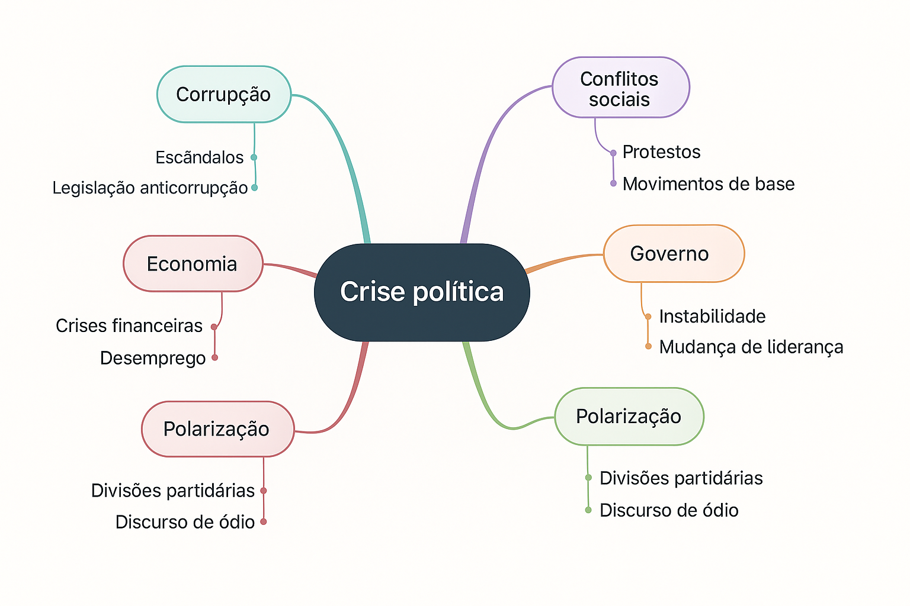

::: nota-secundaria
Roteiro de aula elaborado no RStudio com o auxílio da inteligência artificial, revisado e avaliado pelo autor antes de sua publicação.
:::

## Contextualização

Os gêneros acadêmicos são **formas textuais relativamente estáveis** que emergem das **práticas discursivas** da vida universitária e científica, desempenhando funções comunicativas específicas em contextos institucionalizados. Diferenciam-se por sua vinculação à produção, organização e divulgação do conhecimento, exigindo do autor **domínio de normas, linguagens e propósitos próprios da cultura acadêmica**. Assim, fichamentos, resumos, projetos, artigos, relatos de experiência e teses, entre outros, configuram-se como gêneros que orientam a leitura, a escrita e a argumentação na universidade, contribuindo para a **formação intelectual e científica dos alunos**.

Ao final deste encontro, espera-se que você seja capaz de:

-   **identificar relações** entre práticas sociais e gêneros acadêmicos;
-   **classificar textos** segundo seus gêneros e esferas de circulação.

::: leitura
**Leitura indicada**

**Gêneros acadêmicos** (p. 67–72), capítulo do livro *Leitura e escrita acadêmicas*, de Nádia Studzinski Estima de Castro e colaboradores. Disponível na Minha Biblioteca.
:::

## Leitura em foco

Segundo Luiz Antônio Marcuschi (2002)[^aula_8-1], **gêneros textuais** são formas relativamente estáveis de enunciado, moldadas pelas práticas sociais de linguagem. Eles surgem e se desenvolvem funcionalmente nas culturas em que circulam, atendendo a finalidades comunicativas específicas em contextos determinados.

[^aula_8-1]: MARCUSCHI, L. A. Gêneros textuais: definição e funcionalidade. In: DIONÍSIO, A. P.; MACHADO, A. R.; BEZERRA, M. A. (Orgs.). Gêneros textuais & ensino. Rio de Janeiro: Lucerna, 2002. p. 19-36.

Noutras palavras,

::: citacao
(...) os gêneros textuais são fenômenos históricos, profundamente vinculados à vida cultural e social. (Marcuschi, 2002, p. 19)
:::

**Os gêneros textuais emergem das práticas sociais**, funcionando como formas linguísticas que atendem a **necessidades comunicativas** específicas em contextos determinados. Isso significa que, à medida que diferentes **esferas da vida social** se organizam — como a escola, a academia, o jornalismo, o comércio ou a política —, desenvolvem-se também modos particulares de dizer, com características próprias de conteúdo, forma, finalidade e circulação. Assim, cada prática social dá origem a um conjunto de gêneros que lhe é funcional.



## Aprendizagem prática

A que gêneros os textos abaixo pertencem? E a que esfera social?

::: leitura
**TEXTO 1**

Eu sou a que no mundo anda perdida,<br/> Eu sou a que na vida não tem norte,<br/> Sou a irmã do Sonho, e desta sorte<br/> Sou a crucificada... a dolorida...<br/>

Sombra de névoa tênue e esvaecida,<br/> E que o destino amargo, triste e forte,<br/> Impele brutalmente para a morte!<br/> Alma de luto sempre incompreendida!...<br/>

Sou aquela que passa e ninguém vê...<br/> Sou a que chamam triste sem o ser...<br/> Sou a que chora sem saber porquê...<br/>

Sou talvez a visão que Alguém sonhou,<br/> Alguém que veio ao mundo pra me ver,<br/> E que nunca na vida me encontrou!<br/>

Gênero: \_\_\_\_\_\_\_\_\_\_\_\_\_\_\_\_\_\_\_\_\_\_\_\_<br/> Esfera: \_\_\_\_\_\_\_\_\_\_\_\_\_\_\_\_\_\_\_\_\_\_\_\_<br/>

**TEXTO 2**

Um acidente envolvendo uma carreta, dois caminhões e uma van na manhã desta sexta-feira (30) no Rodoanel, na região de São Bernardo do Campo, na Grande SP, deixou dez pessoas feridas, uma delas presa nas ferragens

A colisão, que aconteceu por volta das 7h30, foi na pista externa na altura do Km 67.

O trânsito está intenso no local e se estende por cerca de 13 quilômetros. Uma faixa continua interditada. Além do acostamento, duas faixas também foram liberadas para o tráfego de veículos.

Como foi o acidente: Segundo a SPMar, concessionária que administra o Rodoanel, a carreta trafegava pela faixa do meio quando, ainda não se sabe por que, reduziu de repente a velocidade. Com isso, a van bateu na sua traseira. Na sequência, o caminhão se chocou contra a traseira da van e foi atingido, em seguida, por outro caminho que vinha atrás.

Gênero: \_\_\_\_\_\_\_\_\_\_\_\_\_\_\_\_\_\_\_\_\_\_\_\_<br/> Esfera: \_\_\_\_\_\_\_\_\_\_\_\_\_\_\_\_\_\_\_\_\_\_\_\_<br/>

**TEXTO 3**

**A Curitybina, para o que é indicado e para o que serve?** A Curitybina facilita a descamação da pele, removendo verrugas comuns e calos.

**Como o A Curitybina funciona?** O ácido salicílico, princípio ativo de A Curitybina, facilita a descamação da pele através da solubilização de substâncias que mantém as camadas da pele unidas, por meio da perda da queratina (substância presente na pele que a mantem resistente e elástica). Essa perda da queratina promove também uma ação antifúngica, suprimindo, portanto, o crescimento de fungos e ajudando na penetração de agentes antifúngicos. O ácido salicílico promove, ainda, uma suave ação antisséptica.

**Quais as contraindicações do A Curitybina?** Você não deve não deve usar A Curitybina se possuir hipersensibilidade a qualquer componente da sua fórmula. A Curitybina solução tópica não deve ser utilizada em pele inflamada, irritada ou infeccionada, em pacientes diabéticos ou com doença vascular periférica (problemas circulatórios nos braços e nas pernas); em verrugas faciais, genitais, orais; verrugas com pelo, pintas e marcas de nascença.

Gênero: \_\_\_\_\_\_\_\_\_\_\_\_\_\_\_\_\_\_\_\_\_\_\_\_<br/> Esfera: \_\_\_\_\_\_\_\_\_\_\_\_\_\_\_\_\_\_\_\_\_\_\_\_<br/>
:::

<!-- Aqui começa o campo de respostas-->

<details class="resposta-escondida">

<summary>...</summary>

| Texto   | Gênero textual       | Esfera social |
|---------|----------------------|---------------|
| Texto 1 | Poema lírico         | Literária     |
| Texto 2 | Notícia jornalística | Jornalística  |
| Texto 3 | Bula de medicamento  | Médica        |

</details>

<!-- Aqui encerra o campo de respostas-->

<br/><br/>

Assim, com base na definição de Marcuschi (2003), podemos entender gêneros textuais **acadêmicos** como formas relativamente estáveis de enunciado que emergem das práticas sociais próprias do meio universitário e científico, como, por exemplo, *registrar leituras*, *relatar experiências*, *divulgar descobertas* ou *planejar investigações*.

Compreendê-los, portanto, é essencial para atuar com eficácia e criticidade no universo acadêmico, desenvolvendo competências de leitura, escrita e fala em consonância com as práticas discursivas da ciência.

::: destaque
📌 Embora as expressões "acadêmico" e "científico" sejam muitas vezes usadas como sinônimos, é importante distinguir seus significados. O termo "acadêmico" abrange todas as práticas de leitura, escrita e fala que ocorrem no contexto universitário, inclusive aquelas com fins pedagógicos, reflexivos ou formativos. Já o termo "científico" refere-se, mais especificamente, à produção de conhecimento novo, sistemático e validado por métodos próprios de investigação.
:::

::: citacao
Cada gênero apresenta características específicas e funções determinadas." (Marcuschi, 2003, p. 19)
:::

Noutras palavras, os gêneros textuais não são formas arbitrárias, mas sim moldadas pelas finalidades comunicativas que cumprem em contextos sociais específicos. Isso significa que as características estruturais, linguísticas e estilísticas de um gênero textual decorrem diretamente das funções que ele desempenha na interação social.

## Aprendizagem prática

Leia com atenção os dois textos apresentados a seguir. Analise-os comparativamente, preenchendo a tabela com as principais diferenças linguísticas entre eles. Utilize os critérios indicados abaixo. Para cada critério, apresente um exemplo retirado do texto que comprove sua análise. Ao final, classifique cada texto quanto ao gênero textual a que pertence.

::: leitura
**TEXTO 1**

Neste trabalho, relata-se a elaboração e a aplicação de jogos educacionais utilizados em aulas de física do ensino médio em uma escola privada da região sul do Brasil durante a pandemia de Covid-19. Todos os jogos apresentados foram elaborados no MS PowerPoint®. Buscou-se confeccionar jogos que fossem atrativos aos estudantes e, por essa razão, alguns deles tinham como temática animes e histórias em quadrinhos (HQs). Os jogos construídos foram elaborados em versões digitais adaptadas de cruzadinhas, stop, memória, ludo e batalha naval e envolveram assuntos como termologia, ondulatória, cinemática e eletrodinâmica. Com a finalidade de compreender as percepções dos estudantes acerca do uso de jogos em sala de aula, aplicou-se um questionário após os estudantes terem diversas aulas nas quais os jogos foram utilizados. Como principais resultados, verificou-se que a característica lúdica do jogo deixa os estudantes mais predispostos com as questões escolares, contribuindo para o aprendizado. Para os alunos, o uso de jogos torna a aula mais dinâmica, aumentando a participação, o engajamento e a interação entre si e com a professora.

**TEXTO 2**

Em um final de semana no começo das férias escolares, eu e meus amigos estávamos nos preparando para uma viagem, a viagem que sempre sonhamos em fazer desde os nossos catorze anos. O dia estava ensolarado, e eu estava arrumando o resto das coisas que haviam faltado, quando recebi mensagem da minha amiga avisando que eu estava atrasada, peguei minhas coisas e saí correndo até o local onde havíamos marcado para esperar o ônibus. Chegando lá, todos os meus amigos já estavam dentro do ônibus e cantando diversas musicas, eu entrei e então seguimos viagem. Chegando na casa de praia, o mar estava lindo, era um belíssimo dia para se divertir na praia, chamei todos os meus amigos e fomos para praia, os meninos nos chamaram para ir até uma floresta que tinha próximo a praia, e então todos nós fomos. Nós entramos dentro da floresta e quando nos demos conta não sabíamos mais como voltar para casa, ficamos desesperados e já estávamos sem saber o que fazer, quando enxergamos a luz da nossa casa, ficamos felizes e saímos correndo até a nossa casa, e assim terminou o nosso primeiro dia de férias.
:::

```{r echo=FALSE, message=FALSE, warning=FALSE, results='asis'}
library(googlesheets4)
library(knitr)
gs4_deauth()

url <- "https://docs.google.com/spreadsheets/d/1meikWk8oShRVvn4Erjs4DwMnWpZorFjLTdaC03WByHg"
tabela <- read_sheet(url, sheet = "Formalidade")

# Substituir NA por "" (funciona com qualquer saída do kable)
tabela[is.na(tabela)] <- ""

kable(tabela, caption = "Características linguísticas", align = rep("c", ncol(tabela)))
```

:::: destaque
::: subtitulo-nao-numerado
📌 Critérios
:::

**Pessoa do discurso**\
Refere-se ao ponto de vista adotado pelo enunciador no texto. A primeira e a segunda pessoas (eu/nós/tu/você) indicam envolvimento direto, comum em relatos pessoais ou reflexões; a terceira pessoa (ele/ela/eles/elas) sinaliza distanciamento, impessoalidade e é preferida em textos científicos.

**Tempo verbal predominante**\
Indica o tempo em que se desenvolvem as ações, fatos ou conceitos apresentados. O pretérito é típico de relatos e narrações de experiências vividas; o presente do indicativo é usual em textos argumentativos e expositivos, especialmente quando se referem a declarações ou análises conceituais. Já os tempos e modos verbais hipotéticos, como o futuro do pretérito (“contribuiria”, “seria possível”) e o subjuntivo (“caso ocorra”, “se fosse”), são frequentes em formulações de hipóteses, projeções e reflexões condicionais, comuns em textos científicos.

**Grau de formalidade**\
Diz respeito ao registro de linguagem utilizado. Textos com alto grau de formalidade evitam expressões coloquiais, usam vocabulário técnico e seguem normas gramaticais com mais rigor. A formalidade é típica da escrita acadêmica, enquanto a informalidade é mais comum em textos pessoais ou cotidianos. O registro coloquial é espontâneo, flexível, emocional. O registro formal é planejado, padronizado, objetivo.

**Tipo de linguagem**\
Refere-se à natureza predominante da linguagem utilizada: **denotativa**, quando o foco está na objetividade e clareza (comum em textos informativos e científicos), ou **conotativa**, quando há subjetividade e uso de figuras de linguagem (comum em textos literários e criativos).

**Uso de conectores**\
Conectores são palavras ou expressões que articulam ideias, estabelecendo relações de causa, consequência, contraste, adição, entre outras. Seu uso adequado favorece a coesão textual e é uma característica fundamental da escrita acadêmica clara e organizada.

**Presença de opinião**\
Indica se o texto expressa posicionamentos pessoais ou interpretações subjetivas. Textos opinativos fazem uso de marcadores como "acredito", "na minha visão", "é evidente que", e devem, no contexto acadêmico, ser sempre acompanhados de fundamentação e evidências.

**Vocabulário**\
Refere-se à escolha lexical do autor. Um vocabulário técnico e preciso é típico da escrita científica; já um vocabulário mais cotidiano, com expressões informais e gírias, caracteriza textos pessoais ou narrativos. A adequação vocabular depende do gênero, do propósito e do público-alvo do texto.
::::

<!-- Aqui começa o campo de respostas-->

<details class="resposta-escondida">

<summary>...</summary>

| Critério | Texto 1 (científico) | Texto 2 (relato pessoal) |
|------------------------|------------------------|------------------------|
| **Pessoa do discurso** | Terceira pessoa do singular: "relata-se", "aplicou-se", "verificou-se", "torna" | Primeira pessoa do singular e plural: "eu", "nós" |
| **Tempo verbal** | Predomínio do pretérito perfeito e do presente: "relata-se", "buscou-se", "verificou-se" | Predomínio do pretérito: "estávamos", "seguimos", "chamei" |
| **Grau de formalidade** | Formal, com vocabulário técnico, impessoalidade, estrutura padrão: "relata-se a elaboração e a aplicação de jogos educacionais" | Informal, com linguagem próxima da oralidade e uso de expressões coloquiais: "peguei minhas coisas e saí correndo" |
| **Tipo de linguagem** | Denotativa, objetiva e referencial: "Com a finalidade de compreender as percepções dos estudantes acerca do uso de jogos em sala de aula, aplicou-se um questionário após os estudantes terem diversas aulas nas quais os jogos foram utilizados." | Conotativa, expressiva e descritiva: "O mar estava lindo, era um belíssimo dia para se divertir na praia." |
| **Uso de conectores** | Apresenta conectores típicos da argumentação científica, que estabelecem relações de causa, finalidade e consequência com linguagem formal e precisa: “com a finalidade de” – conector típico de propósito, muito frequente em relatórios, projetos e artigos; “por essa razão”, “como principais resultados” – organizadores textuais que estruturam logicamente o texto acadêmico | Apresenta conectores típicos de sequenciação temporal e causalidade espontânea, característicos da oralidade e da narração do cotidiano: “quando”, “então”, “e assim” – expressões que marcam o encadeamento cronológico de ações, muito comuns em gêneros como relato pessoal, diário e narrativa experiencial |
| **Presença de opinião** | Ausente ou implícita, com base em dados | Presente e direta: "ficamos desesperados", "era um belíssimo dia" |
| **Vocabulário** | Técnico e específico: "característica lúdica", "percepções", "cinemática", "instrumentos de pesquisa" | Cotidiano e afetivo: "casa de praia", "coisas", "cantando músicas", "nossos catorze anos" |

**Classificação dos gêneros**:

-   **Texto 1**: Resumo (parte de um artigo científico)

-   **Texto 2**: Relato pessoal

</details>

<!-- Aqui encerra o campo de respostas-->

## Leitura em foco

::: citacao
“Os gêneros textuais acadêmicos se caracterizam \[conhecem\] muito mais pela função comunicativa e institucional do que por estruturas linguísticas” (Castro *et al*., 2019, p. 68).
:::

Para fins didáticos, proponho uma organização didática dos gêneros acadêmicos em três grupos funcionais:

1.  **Gêneros de estudo**: São gêneros que auxiliam o estudante na compreensão, análise e sistematização de obras e conteúdos acadêmicos.

    ✦ Fichamento

    ✦ Resenha

    ✦ Resumo

2.  **Gêneros de planejamento acadêmico**: São textos utilizados na organização das atividades de pesquisa, extensão ou ensino, geralmente em etapas iniciais.

    ✦ Plano de trabalho

    ✦ Projeto de pesquisa

3.  **Gêneros de informação/divulgação científica**: São produções destinadas à comunicação de resultados, experiências e reflexões, seja no meio acadêmico ou na interface com a sociedade.

    ✦ Artigo científico

    ✦ Relato de experiência

    ✦ Comunicação oral

    ✦ Squib (ou nota técnica)

4.  **Gêneros de conclusão de cursos**: São produções de caráter conclusivo, elaboradas ao término de cursos de graduação e pós-graduação, com exigências metodológicas formais.

    ✦ TCC ou Monografia

    ✦ Dissertação (Mestrado)

    ✦ Tese (Doutorado)

::: proxima-aula
[Para a próxima aula:]{.proxima-aula-title}

-   **Leia** o texto **Fichamento acadêmico** (p. 53–64), capítulo do livro *Leitura e escrita acadêmicas*, de Nádia Studzinski Estima de Castro e colaboradores. Disponível na Minha Biblioteca.
:::
