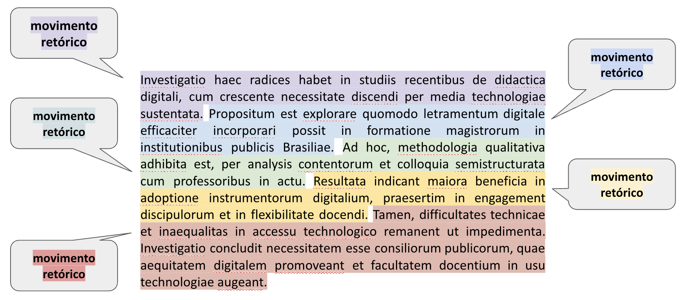
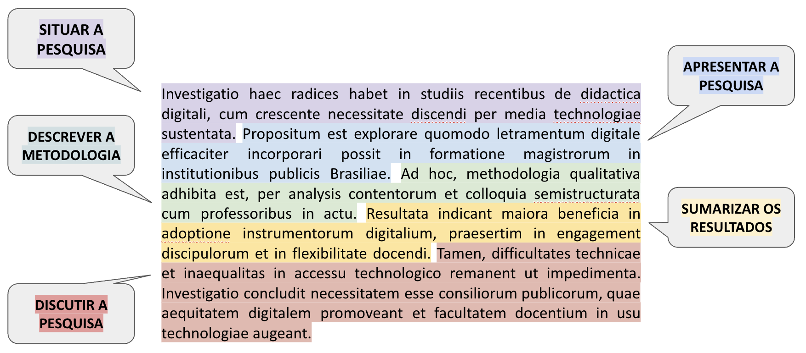

::: nota-secundaria
Roteiro de aula elaborado no RStudio com o auxílio da inteligência artificial ChatGPT e supervisionado pelo professor antes de sua publicação.
:::

## Contextualização

Ao final deste encontro, espera-se que você seja capaz de:

-   Compreender a função do resumo no contexto acadêmico;
-   Identificar os movimentos retóricos típicos do gênero resumo;

::: leitura
**Leitura indicada**

**Gêneros acadêmicos** (p. 67–72), capítulo do livro *Leitura e escrita acadêmicas*, de Nádia Studzinski Estima de Castro e colaboradores. Disponível na Minha Biblioteca.

**Abstract/resumo acadêmico** (p. 151-162), capítulo do livro *Produção textual na universidade*, de Désirée Motta-Roth e Graciela Rabuske Hendge. Disponível na Biblioteca Física.
:::

## Foco na leitura

**Gêneros textuais**

-   são realizações linguísticas concretas definidas por propriedades sociocomunicativas;
-   constituem textos empiricamente realizados, cumprindo funções em situações comunicativas;
-   a sua nomeação abrange um conjunto aberto e praticamente ilimitado de designações concretas determinadas por canal, estilo, conteúdo, composição e função.

<br/> Compreender o funcionamento dos gêneros acadêmicos exige não apenas o reconhecimento de suas funções sociocomunicativas, mas também a análise de como essas funções se concretizam linguisticamente. É nesse ponto que entra o conceito de estrutura retórica.

::: citacao
A partir de Swales (2004)[^aula_12_resumo-1], pode-se definir **estrutura retórica** como a organização funcional de um gênero textual em movimentos retóricos recorrentes, orientados para o cumprimento de objetivos comunicativos específicos. Essa estrutura considera o contexto de produção, a audiência e as convenções disciplinares ou culturais da comunidade discursiva a que pertence o gênero.
:::

[^aula_12_resumo-1]: SWALES, J. M. Research Genres Explorations and Applications. Cambridge: Cambridge University Press, 2004.

Ainda em linha com Swales (2004), um **movimento retórico** é uma unidade discursiva que desempenha uma função comunicativa coerente em um discurso escrito ou oral.

::: imagem

:::

<br/>

Agora vamos aprofundar nosso conhecimento sobre a estrutura retórica de alguns dos gêneros textuais mais recorrentes na esfera universitária, a começar pelo **resumo**.

O **resumo** - ou *abstract*, em inglês - é um gênero textual que sintetiza as informações mais relevantes de um trabalho científico. Esse gênero pode ocorrer de maneira autônoma, como em resumos publicados isoladamente nos anais de eventos acadêmicos ou em bancos de dados, ou ainda integrar outras produções científicas, como artigos, relatórios técnicos, dissertações e teses, funcionando como parte estratégica do texto completo.

::: citacao
Como sintetizam Motta-Roth e Rabuske (2010), para que cumpra seu papel com clareza e eficácia, o resumo precisa organizar-se em movimentos retóricos específicos, que orientam o leitor quanto ao contexto da pesquisa, aos objetivos e métodos empregados, e aos principais resultados alcançados.


:::

Analise a tabela abaixo. Trata-se dos movimentos retóricos do resumo científico, como identificado por Motta-Roth e Rabuske (2010). Observe que, em alguns casos, os movimentos têm diferentes submovimentos.

```{r}
#| echo: false
#| message: false
#| warning: false
library(knitr)
library(kableExtra)

# Dados sem a coluna de exemplo
dados_resumidos <- data.frame(
  Movimento = c(
    "1. Situar a pesquisa", "", "", "", "", "",
    "2. Apresentar a pesquisa", "", "",
    "3. Descrever a metodologia",
    "4. Sumarizar os resultados",
    "5. Discutir a pesquisa", ""
  ),
  Submovimentos = c(
    "Estabelecer interesse no tópico",
    "Fazer generalizações do tópico",
    "Citar pesquisas prévias",
    "Estender pesquisas prévias",
    "Contra-argumentar pesquisas prévias",
    "Indicar lacunas em pesquisas prévias",
    "Indicar as principais características",
    "Apresentar objetivo(s)",
    "Levantar hipótese(s)",
    "Apresentar procedimento(s)",
    "Apontar principais achados",
    "Apresentar conclusão(ões)",
    "Recomendar aplicação(ões) futura(s)"
  )
)

kable(dados_resumidos, align = "l", col.names = c("Movimento", "Submovimentos")) %>%
  kable_styling(full_width = FALSE, bootstrap_options = c("striped", "hover")) %>%
  add_footnote("Fonte: Adaptado de Motta-Roth e Rabuske (2010).")
```

## Aprendizagem prática

::: subtitulo-nao-numerado
Identificação
:::

::: subsubtitulo-nao-numerado
Quais são os movimentos retóricos do resumo científico?
:::

Para cada exemplo abaixo, selecione o submovimento retórico que melhor o representa. Depois, clique no botão "Verificar respostas". Você verá seu total de acertos.

```{=html}

<style>
  .tabela-retorica {
    border-collapse: collapse;
    width: 100%;
    margin-bottom: 2em;
  }

  .tabela-retorica th, .tabela-retorica td {
    border: 1px solid #ccc;
    padding: 12px;
    vertical-align: top;
  }

  .tabela-retorica th {
    background-color: #f2f2f2;
    text-align: left;
  }

  .dropdown-retorico {
    width: 100%;
    padding: 6px;
    font-size: 14px;
  }

  #resultado-acertos {
    font-weight: bold;
    margin-top: 1em;
    font-size: 1.1em;
  }

  #botao-verificar {
    background-color: #007BFF;
    color: white;
    border: none;
    padding: 10px 18px;
    border-radius: 6px;
    cursor: pointer;
    font-size: 1em;
    margin-bottom: 1em;
  }
</style>

<table class="tabela-retorica">
  <thead>
    <tr>
      <th>Exemplo</th>
      <th>Submovimento retórico</th>
    </tr>
  </thead>
  <tbody id="tabela-exemplos">
  </tbody>
</table>

<button id="botao-verificar">✅ Verificar respostas</button>
<div id="resultado-acertos"></div>

<script>
const dados = [
  {
    exemplo: "O ensino de Física por meio de metodologias ativas tem ganhado destaque nos últimos anos.",
    correto: "Estabelecer interesse no tópico"
  },
  {
    exemplo: "Estudos apontam que os alunos demonstram maior engajamento quando a Física é ensinada com recursos experimentais.",
    correto: "Fazer generalizações do tópico"
  },
  {
    exemplo: "Pesquisas como as de Silva et al. (2021) destacam o uso de jogos didáticos no ensino de cinemática.",
    correto: "Citar pesquisas prévias"
  },
  {
    exemplo: "Este estudo amplia a proposta de Moreira (2020) ao aplicar a metodologia em turmas do 2º ano.",
    correto: "Estender pesquisas prévias"
  },
  {
    exemplo: "Diferente de autores anteriores, não se investigaram os efeitos do lúdico na aprendizagem significativa.",
    correto: "Contra-argumentar pesquisas prévias"
  },
  {
    exemplo: "Ainda são escassos os estudos que avaliam o impacto do uso de simuladores virtuais em escolas públicas.",
    correto: "Indicar lacunas em pesquisas prévias"
  },
  {
    exemplo: "Trata-se de uma investigação qualitativa com ênfase na análise de relatos de professores da rede básica.",
    correto: "Indicar as principais características"
  },
  {
    exemplo: "O objetivo é avaliar a eficácia de uma sequência didática baseada em experimentos de óptica.",
    correto: "Apresentar objetivo(s)"
  },
  {
    exemplo: "Hipotetiza-se que atividades experimentais favorecem a compreensão conceitual de fenômenos físicos.",
    correto: "Levantar hipótese(s)"
  },
  {
    exemplo: "A metodologia envolveu aplicação de uma sequência didática com uso de simuladores PhET.",
    correto: "Apresentar procedimento(s)"
  },
  {
    exemplo: "Os resultados mostram melhora significativa no desempenho dos alunos após as intervenções.",
    correto: "Apontar principais achados"
  },
  {
    exemplo: "Conclui-se que o uso de tecnologia digital contribui para a aprendizagem em Física.",
    correto: "Apresentar conclusão(ões)"
  },
  {
    exemplo: "Sugere-se replicar o estudo em outras redes de ensino com diferentes perfis de estudantes.",
    correto: "Recomendar aplicação(ões) futura(s)"
  }
];

const opcoes = [
  "Estabelecer interesse no tópico",
  "Fazer generalizações do tópico",
  "Citar pesquisas prévias",
  "Estender pesquisas prévias",
  "Contra-argumentar pesquisas prévias",
  "Indicar lacunas em pesquisas prévias",
  "Indicar as principais características",
  "Apresentar objetivo(s)",
  "Levantar hipótese(s)",
  "Apresentar procedimento(s)",
  "Apontar principais achados",
  "Apresentar conclusão(ões)",
  "Recomendar aplicação(ões) futura(s)"
];

function embaralhar(array) {
  return array.sort(() => Math.random() - 0.5);
}

function construirTabela() {
  const corpo = document.getElementById("tabela-exemplos");
  dados.forEach((item, i) => {
    const tr = document.createElement("tr");

    const tdExemplo = document.createElement("td");
    tdExemplo.textContent = item.exemplo;

    const tdSelect = document.createElement("td");
    const select = document.createElement("select");
    select.className = "dropdown-retorico";
    select.setAttribute("data-correto", item.correto);

    const optInicial = document.createElement("option");
    optInicial.textContent = "-- Escolha --";
    optInicial.value = "";
    select.appendChild(optInicial);

    embaralhar(opcoes).forEach(op => {
      const option = document.createElement("option");
      option.value = op;
      option.textContent = op;
      select.appendChild(option);
    });

    tdSelect.appendChild(select);
    tr.appendChild(tdExemplo);
    tr.appendChild(tdSelect);
    corpo.appendChild(tr);
  });
}

document.getElementById("botao-verificar").addEventListener("click", () => {
  const selects = document.querySelectorAll(".dropdown-retorico");
  let acertos = 0;

  selects.forEach(select => {
    const valor = select.value;
    const correto = select.getAttribute("data-correto");
    if (valor === correto) {
      acertos++;
      select.style.border = "2px solid green";
    } else {
      select.style.border = "2px solid red";
    }
  });

  document.getElementById("resultado-acertos").textContent = `Você acertou ${acertos} de ${selects.length}.`;
});

construirTabela();
</script>
```

```{=html}
<!--
**Resumo**

O ensino de Física por meio de metodologias ativas tem ganhado destaque nos últimos anos. Estudos apontam que os alunos demonstram maior engajamento quando a Física é ensinada com recursos experimentais. Pesquisas como as de Silva et al. (2021) destacam o uso de jogos didáticos no ensino de cinemática. Este estudo amplia a proposta de Moreira (2020) ao aplicar a metodologia em turmas do 2º ano. Diferente de autores anteriores, não se investigaram os efeitos do lúdico na aprendizagem significativa. Ainda são escassos os estudos que avaliam o impacto do uso de simuladores virtuais em escolas públicas. Trata-se de uma investigação qualitativa com ênfase na análise de relatos de professores da rede básica. O objetivo é avaliar a eficácia de uma sequência didática baseada em experimentos de óptica. Hipotetiza-se que atividades experimentais favorecem a compreensão conceitual de fenômenos físicos. A metodologia envolveu aplicação de uma sequência didática com uso de simuladores PhET. Os resultados mostram melhora significativa no desempenho dos alunos após as intervenções. Conclui-se que o uso de tecnologia digital contribui para a aprendizagem em Física. Sugere-se replicar o estudo em outras redes de ensino com diferentes perfis de estudantes.
:::
-->
```

## Aprendizagem prática

::: subtitulo-nao-numerado
Identificação
:::

::: subsubtitulo-nao-numerado
Quais são os movimentos retóricos do resumo científico?
:::

Para esta atividade, selecione um **artigo científico completo** que atenda aos seguintes critérios:

```         
✦ Esteja **relacionado ao seu tema de pesquisa**.\
✦ Tenha sido **publicado em periódico científico classificado como A ou B** no Qualis (última atualização disponível).\
✦ Esteja **disponível em acesso aberto**.\
✦ Tenha passado por **revisão por pares** (peer-reviewed).\
✦ Tenha um **resumo explícito**, preferencialmente em português.
```

2.  Copie o texto integral do resumo e cole no campo apropriado do formulário abaixo.

3.  Realize a segmentação do resumo conforme os cinco movimentos retóricos propostos.

-   Para cada movimento identificado, copie e cole no campo correspondente o(s) trecho(s) que o representa(m); e classifique-o segundo as opções disponíveis no formulário.

-   Se um movimento não estiver presente no resumo, indique isso no formulário, selecionando a opção “Movimento não acontece”.

-   Se houver um movimento cuja classificação não esteja disponível, nomeie-o no campo adequado.

📌 Recomendações importantes:

-   Certifique-se de analisar criticamente o resumo, considerando a função comunicativa de cada trecho e não apenas marcadores superficiais.

-   Esta atividade visa o desenvolvimento da consciência retórica, contribuindo para a sua própria capacidade de escrever bons resumos científicos no futuro.

-   A análise deve ser feita individualmente, com base nos princípios estudados em aula.

------------------------------------------------------------------------

<!-- 🌐 Formulário para anotação de movimentos retóricos em resumos -->

::: formulario
```{=html}
<style>
  .form-container {
    max-width: 800px;
    margin: auto;
    padding: 1.5em;
    font-family: "Segoe UI", Arial, sans-serif;
    background-color: #f9f9f9;
    border-radius: 12px;
    box-shadow: 0 0 12px rgba(0,0,0,0.08);
    box-sizing: border-box;
  }

  .form-container h2 {
    text-align: center;
    color: #333;
    margin-bottom: 1em;
  }

  .form-container label {
    display: block;
    margin-bottom: 0.5em;
    color: #222;
    font-weight: 600;
  }

  .form-container input,
  .form-container textarea,
  .form-container select {
    width: 100%;
    padding: 0.75em;
    border: 1px solid #ccc;
    border-radius: 6px;
    box-sizing: border-box;
    font-size: 1em;
    margin-bottom: 1.2em;
  }

  .form-container textarea {
    resize: vertical;
  }

  .form-container button {
    background-color: #007acc;
    color: white;
    padding: 0.9em 1.2em;
    font-size: 1em;
    border: none;
    border-radius: 6px;
    cursor: pointer;
    width: 100%;
    transition: background-color 0.3s ease;
  }

  .form-container button:hover {
    background-color: #005f99;
  }

  @media (max-width: 600px) {
    .form-container {
      padding: 1em;
    }
  }
</style>
```

```{=html}
<div class="form-container">
  <form id="form-resumo">

    <h2>📄 Análise de resumos</h2>

    <label>Seu nome:
      <input type="text" name="nome" required>
    </label>

    <label><strong>Título do artigo:</strong>
      <input type="text" name="titulo" required placeholder="Informe o título do artigo analisado">
    </label>
    
    <label><strong>Área de conhecimento:</strong>
      <input type="text" name="area" required placeholder="Informe a área de conhecimento do artigo analisado (conforme informado no Qualis)">
    </label>

    <label>Resumo:
      <textarea name="resumo" rows="5" required placeholder="Cole aqui o texto integral do resumo..."></textarea>
    </label>

    <!-- Situar -->
    <label>Situando a pesquisa:
      <textarea name="situar_texto" rows="3" placeholder="Cole aqui o trecho que situa a pesquisa"></textarea>
    </label>
    <label>Selecione o(s) modo(s) como a pesquisa está sendo situada:<br/>
      <small>(Use Ctrl ou Shift para selecionar mais de uma opção)</small>
      <select name="situar_opcao[]" multiple>
        <option>Indicando o interesse no tópico de pesquisa</option>
        <option>Fazendo generalizações sobre o tópico de pesquisa</option>
        <option>Estendendo pesquisas prévias</option>
        <option>Citando pesquisas prévias</option>
        <option>Contra-argumentando pesquisas prévias</option>
        <option>Indicando lacunas em pesquisas prévias</option>
        <option>Indicando a área de conhecimento</option>
        <option>Movimento não acontece</option>
        <option>Outro</option>
      </select>
    </label>
    
    <label>Se você marcou "Outro" acima, descreva aqui:
      <input type="text" name="situar_outro" placeholder="Descreva a alternativa não listada">
    </label>

    <!-- Apresentar -->
    <label>Apresentando a pesquisa:
      <textarea name="apresentar_texto" rows="3" placeholder="Cole aqui o trecho que apresenta a pesquisa"></textarea>
    </label>
    <label>Selecione o(s) modo(s) como a pesquisa está sendo apresentada:<br/>
      <small>(Use Ctrl ou Shift para selecionar mais de uma opção)</small>
      <select name="apresentar_opcao[]" multiple>
        <option>Indicando as principais características da pesquisa</option>
        <option>Apresentando o(s) principal(is) objetivo(s)</option>
        <option>Levantando hipóteses</option>
        <option>Movimento não acontece</option>
        <option>Outro</option>
      </select>
    </label>
    
    <label>Se você marcou "Outro" acima, descreva aqui:
      <input type="text" name="apresentar_outro" placeholder="Descreva a alternativa não listada">
    </label>

    <!-- Metodologia -->
    <label>Descrevendo a metodologia:
      <textarea name="metodologia_texto" rows="3" placeholder="Cole aqui o trecho que descreve a metodologia"></textarea>
    </label>
    <label>Selecione o(s) modo(s) como a metodologia está sendo descrita:<br/>
      <small>(Use Ctrl ou Shift para selecionar mais de uma opção)</small>
      <select name="metodologia_opcao[]" multiple>
        <option>Descrevendo participantes/corpus</option>
        <option>Indicando tipo de estudo/abordagem</option>
        <option>Descrevendo procedimentos/métodos</option>
        <option>Indicando a procedência dos dados</option>
        <option>Movimento não acontece</option>
        <option>Outro</option>
      </select>
    </label>
    
    <label>Se você marcou "Outro" acima, descreva aqui:
      <input type="text" name="metodologia_outro" placeholder="Descreva a alternativa não listada">
    </label>

    <!-- Resultados -->
    <label>Apresentando o(s) resultado(s):
      <textarea name="resultados_texto" rows="3" placeholder="Cole aqui o trecho que apresenta os resultados"></textarea>
    </label>
    <label>Selecione o(s) modo(s) como o(s) resultado(s) está(ão) sendo apresentados:<br/>
      <small>(Use Ctrl ou Shift para selecionar mais de uma opção)</small>
      <select name="resultados_opcao[]" multiple>
        <option>Apresentando resultados qualitativos</option>
        <option>Apresentando resultados quantitativos</option>
        <option>Movimento não acontece</option>
        <option>Outro</option>
      </select>
    </label>
    
    <label>Se você marcou "Outro" acima, descreva aqui:
      <input type="text" name="resultados_outro" placeholder="Descreva a alternativa não listada">
    </label>

    <!-- Discussão -->
    <label>Discutindo a pesquisa:
      <textarea name="discutir_texto" rows="3" placeholder="Cole aqui o trecho que discute a pesquisa"></textarea>
    </label>
    <label>Selecione o(s) modo(s) como a pesquisa está sendo discutida:<br/>
      <small>(Use Ctrl ou Shift para selecionar mais de uma opção)</small>
      <select name="discutir_opcao[]" multiple>
        <option>Elaborando conclusões</option>
        <option>Recomendando futuras aplicações e/ou pesquisas</option>
        <option>Movimento não acontece</option>
        <option>Outro</option>
      </select>
    </label>
    
    <label>Se você marcou "Outro" acima, descreva aqui:
      <input type="text" name="discutir_outro" placeholder="Descreva a alternativa não listada">
    </label>
    
    <label>Comentários ou observações adicionais:
      <textarea name="comentarios" rows="3" placeholder="Use este espaço caso queira comentar algo sobre sua análise.">
      </textarea>
    </label>

    <button type="submit">Enviar</button>
  </form>
</div>
```

```{=html}
<script>
document.getElementById('form-resumo').addEventListener('submit', function(e) {
  e.preventDefault();
  const form = e.target;
  const data = new FormData(form);
  const params = new URLSearchParams();

  for (const pair of data.entries()) {
    params.append(pair[0], pair[1]);
  }

  fetch('https://script.google.com/macros/s/AKfycbx37cRJdkKW7cv2J3-203rnUhzdop6KuvNE8p18uPjWq4rQ7KsVLjCIjyUXRUT_mZvW9g/exec', {
    method: 'POST',
    body: params
  })
  .then(response => response.text())
  .then(msg => alert(msg))
  .catch(error => alert('Erro ao enviar: ' + error));
});
</script>
```
:::
